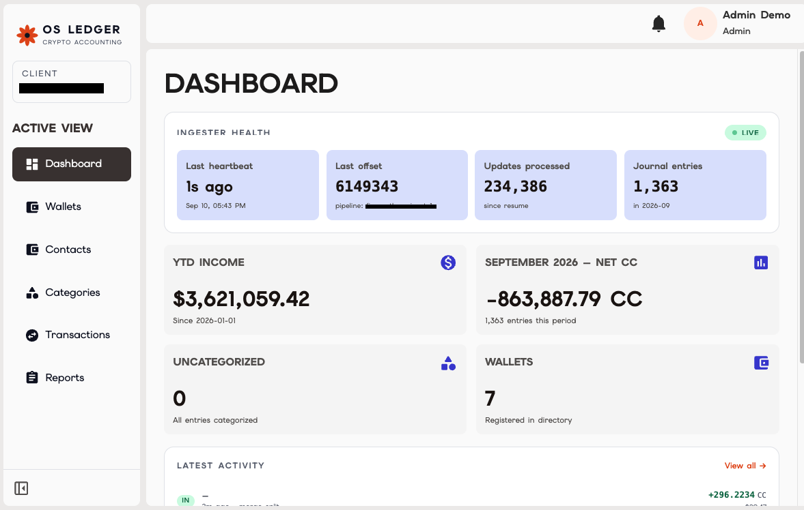
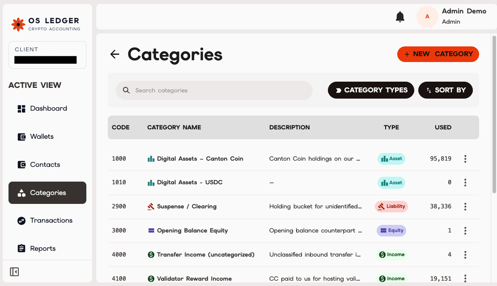

## Development Fund Proposal

**Author:** Outer Sunset (outersunset.io) — Long Do
**Status:** Draft
**Created:** 2026-09-10
**Label:** regulatory-compliance
**Champion:** 

---

## Abstract

Every validator operator, app provider, and Super Validator on Canton earns Canton Coin and pays network fees every round, yet none of them can close their books without a CSV export, a spreadsheet, and one person who knows how the formulas work. There is no open, purpose-built way to turn Canton ledger activity into double-entry journal entries, a controlled month-end close, and an audit trail that traces every reported number back to an on-chain transaction.

OS Ledger is a finance-close stack for Canton. It is in production against a Super Validator's live validator: a read-only Ledger API ingester, a categorization rule engine, double-entry journal generation, sign-aware reconciliation against the active contract set, a maker-checker approval workflow, a period-close gate, a bookkeeper web application, and an on-ledger poster that commits each approved journal entry as an OSLedger:JournalEntry Daml contract. Two Canton organizations are using it in production today, with one Super Validator (Five North) as the anchor deployment.

This proposal asks the Foundation to fund two things. First, **releasing the stack as open source under Apache 2.0**, hardening it for self-hosted deployment, and completing the remaining pieces (period-level on-ledger attestation with an independent verifier, GL exporters, audit packages that survive system shutdown). Second, **operating OS Ledger as a managed service for the Canton ecosystem**: Outer Sunset runs dedicated, isolated deployments for validator operators, app providers, and SVs that do not want to run finance infrastructure themselves, with the Foundation's maintenance funding partially offsetting the hosting cost so that onboarding is free or low-cost during the subsidized term. Delivery completes with the open-source release by 31 October 2026, followed by an adoption-gated milestone and an annual service and maintenance commitment.

## Licensing, Open-Source Posture, and Service Model

All grant-funded software — including the existing codebase — is released under Apache 2.0 with full source on public GitHub under the outer-sunset organization:

- os-ledger-core — TypeScript ingester (@grpc/grpc-js against Ledger API v2), decode and booking passes, categorization rules, reconciliation, Drizzle ORM schema and idempotent migrations (Postgres 16/17)

- os-ledger-app — Next.js bookkeeper web app (dashboard, wallets, transactions, categories, approvals, close, reports, audit log)

- os-ledger-poster — on-ledger journal poster over JSON Ledger API v2 (Node CLI and Cloudflare Worker), cursor and receipt store

- os-ledger-daml — OSLedger Daml package (JournalEntry, FinalizedRollup, RollupAdjustment) and verifier CLI

- os-ledger-deploy — Docker Compose and Kubernetes (k3s) manifests, operator runbooks

- Documentation: architecture, accounting treatment notes per Splice event type, discovery log, schema specification

Any organization may self-host the full stack with no dependency on Outer Sunset. Self-hosted and managed deployments run the same code with the same features.

**Caption:** OS Ledger bookkeeper dashboard on a live MainNet deployment — ingester health, period totals, and uncategorized count.

**Managed service.** Outer Sunset operates OS Ledger as a managed service for Canton organizations: one isolated deployment per client (own ingester, own database, own poster), connected through a client-issued, revocable, read-only credential on whitelisted IPs, with audit packages held by the client. The service is a first-class deliverable of this proposal, not a side business:

- During the subsidized term (12 months from M5 acceptance), managed onboarding and hosting are provided **at no charge to up to 15 Canton organizations** (validator operators, app providers, SVs), first come first served, with priority for organizations that have not previously run accounting infrastructure on Canton.

- Beyond the 15 subsidized seats, or after the term, hosting is offered at **published cost-recovery pricing**, with the price list in the public repository. Any client may migrate to self-hosting at any time using the published manifests and their own audit packages.

- Foundation maintenance funding covers the engineering upkeep of the open-source stack and the infrastructure for the subsidized seats. It does not cover bespoke integration, white-label work, or support contracts, which Outer Sunset sells separately.

## Specification

### 1. Objective

Give every organization operating on Canton an open, verifiable way to produce accounting records from ledger activity — from raw participant events to balanced journal entries, a controlled close, and an attestation an auditor can check independently — and get it into production use across the validator ecosystem.

### 2. Implementation Mechanics

**Ingest (Ledger API → decoded events).** A TypeScript ingester streams UpdateService.GetUpdates and StateService.GetActiveContracts over gRPC from the operator's participant using an OAuth M2M read-only client. A decode pass recognizes Splice templates — Amulet, LockedAmulet, TransferInstruction, AmuletRules\_Transfer results, ValidatorRewardCoupon / AppRewardCoupon / SvRewardCoupon, FeaturedAppActivityMarker — and writes normalized rows carrying round number, amuletPrice (CC↔USD at ledger time), tx\_kind, per-reward-type breakdown, per-output sequencer/mediator fees, and Amulet decay metadata (initialAmount, createdAtRound, ratePerRound). Ingestion resumes from a stored offset and is idempotent. An ENTITY\_PARTIES filter scopes books to the operator's own parties so a wallet-as-a-service provider hosting customer parties does not book customer transfers as its own.

**Caption:** The Canton reference chart of accounts as configured in the application, with per-category usage counts.

*Design note:* the original design read from PQS. During Phase 0 the vendor PQS Scribe failed against a Canton 3.5.1 ingress in production (UNAVAILABLE, isolated to Scribe's HTTP/2 client behavior) while grpc-js succeeded, so the ingester talks to the Ledger API directly. A PQS-backed read path is added in M5.

**Post (events → journal).** A priority-ordered categorization rule engine maps decoded events to accounts in a Canton-specific chart of accounts (1000 Digital Assets – CC, 2900 Suspense/Clearing, 3000 Opening Balance Equity, 4100/4200/4300 Validator/App/SV Reward Income, 6100 Network Holding Fees, 6200 Sequencer/Mediator Fees, with uncategorized income and payment buckets). Every entry is double-entry, balanced in USD, carries the CC amount, and links to its source update ID. Anything unmatched falls to suspense via a fallback-suspense rule and blocks the close. Rules and account codes are versioned configuration with a changelog.

**Reconcile.** A sign-aware reconciliation snapshot compares ACS holdings (net of Amulet decay) with booked balances. A positive gap proposes an opening-balance entry; a negative gap proposes a holding-fee adjustment. Proposals go through the approval queue; the pipeline reconciles to fractions of a cent on the anchor deployment.

**Close.** Periods carry a period\_close\_state. Close is refused while any uncategorized or draft entry remains in the period; on close the readiness counters are frozen into the close record. Maker-checker separation is enforced at the database level (chk\_approval\_maker\_not\_checker); role-based policy gates propose, approve, and period:close. Every action lands in an append-only audit\_log. Export and audit-package history records file hashes, config-snapshot hash, and audit-log hash per run.

**Attest (journal → ledger).** The poster reads approved entries (read-only against the accounting DB), maps each to OSLedger:JournalEntry create arguments — entry ID, source update ID, effective date, CC and USD amounts, lines, status — and submits via POST /v2/commands/submit-and-wait-for-transaction, recording the contract ID and advancing a cursor. It runs as one Cloudflare Worker per tenant on a cron, with a POSTING\_ENABLED kill switch and manual-only MainNet deploys. Period-level FinalizedRollup / RollupAdjustment templates are specified in the schema and are completed in M5 along with an independent verifier.

**Export.** Journal and rollup CSV exports compatible with QuickBooks and other accounting software, plus QuickBooks IIF and Online journal import, Xero, and a generic GL CSV with account-code mapping (M5).

**Operational model.** Single-tenant by construction, whether self-hosted or managed: own ingester, own database, own service per client. Access is a client-issued, revocable, read-only credential on whitelisted IPs. OS Ledger writes to the ledger only through the explicit attestation flow. Managed deployments are provisioned from the same os-ledger-deploy manifests any self-hoster uses.

### 3. Architectural Alignment

- Consumes the public **Ledger API v2** and Splice/Amulet templates directly; no protocol changes and no privileged access.

- Tracks **CIP-0056** holdings (Splice.Api.Token.HoldingV1 deduplicated against Amulet) and will track **CIP-0112 (Token Standard V2)** as ratified.

- Respects Canton's **privacy model**: the ingester sees only the operator's own parties, so the accounting view is scoped exactly to what the participant already holds.

- On-ledger records use ordinary Daml templates with the operator (and optionally the auditor) as signatories.

- Complements the funded OSS validator/indexer/PQS work by offering a PQS-backed read path as an alternative ingestion source.

### 4. Backward Compatibility

None. OS Ledger is read-only against the participant and adds an optional Daml package. Existing participants, apps, and wallets are unaffected.

## Milestones and Deliverables

Milestones 1–5 cover the engineering deliverables and complete with the open-source release on **31 October 2026**. Milestone 6 gates on ecosystem adoption after release. Maintenance is a separate annual commitment. Each milestone is verified by the committee against the public repository and on-ledger evidence.

### Milestone 1: Ledger API Ingester and Canton Accounting Event Model

- **Estimated Delivery:** 30 September 2026

- **Focus:** Direct gRPC ingester with OAuth M2M auth; decode pass for Splice templates; normalized schema (7 clusters, Drizzle ORM, idempotent migrations); round number, amuletPrice, per-reward-type and per-output-fee columns; Amulet decay metadata; offset store and resumable streaming; ENTITY\_PARTIES party-scoping filter; Splice transaction-type coverage map and discovery log.

- **Deliverables / Value Metrics:**

  - Ingester source, schema specification, and migrations published to the public repository and available for committee review.

  - Architecture and design documents (Ledger API data flow, decode rules, schema DDL, security and privacy model, Scribe → direct gRPC architecture decision record) published to the public repository.

  - Ingester running continuously against a Super Validator's live validator on Canton 3.5.x, processing on the order of 7,000 journal entries per month, verifiable by committee against the deployment's ingester health metrics.

- **Amount:** 1.25M CC

### Milestone 2: Journal Engine, Chart of Accounts, and Reconciliation

- **Estimated Delivery:** 30 September 2026

- **Focus:** Priority-ordered categorization rule engine with suspense fallback; double-entry booking with USD and CC on every line and a source update ID; Canton reference chart of accounts (1000–6999); sign-aware ACS reconciliation with opening-balance and holding-fee adjustment proposals; in-process projector; journal and rollup CSV exports compatible with QuickBooks and other accounting software.

- **Deliverables / Value Metrics:**

  - Rule engine, chart of accounts, reconciliation module, and accounting treatment notes published to the public repository and available for committee review.

  - Reconciliation of booked balances to on-chain holdings within 0.01 CC on a live MainNet or DevNet deployment, demonstrated to the committee.

  - Full monthly periods booked for **2 organizations**, with automatic categorization covering ≥ 95% of transaction volume and the remainder routed to suspense.

- **Amount:** 1.5M CC

### Milestone 3: Maker-Checker, Period Close, and Bookkeeper Application

- **Estimated Delivery:** 15 October 2026

- **Focus:** Approval queue with database-enforced maker/checker separation; role-based authorization; period-close state with an uncategorized/draft gate; append-only audit log; export and audit-package history with file, configuration-snapshot, and audit-log hashes; web application (dashboard with ingester health, wallets, transactions with bulk categorization, categories, approvals, close, reports, audit log); Docker Compose and Kubernetes deployment options with runbooks.

- **Deliverables / Value Metrics:**

  - Application source, control model documentation, and deployment runbooks published to the public repository and available for committee review.

  - Committee-verifiable demonstration that a period cannot be closed while uncategorized or draft entries remain, and that the preparer of an entry cannot approve it.

  - Finance owners at **2 organizations** complete month-end close in the application, producing a Journal Entry Summary in which every line traces to its on-chain update ID.

- **Amount:** 1.5M CC

### Milestone 4: On-Ledger Journal Attestation

- **Estimated Delivery:** 15 October 2026

- **Focus:** OSLedger:JournalEntry Daml template; poster over JSON Ledger API v2 with cursor and receipt store, Node CLI and scheduled Worker runtimes, per-tenant deployment, posting kill switch, and manual-only MainNet deploys; mining-round CC/USD pricing on receipts via the validator wallet API; network-free test suite.

- **Deliverables / Value Metrics:**

  - Daml package, poster source, and deployment configuration published to the public repository and available for committee review.

  - JournalEntry contracts committed on MainNet for at least **1 organization**, with contract IDs and receipts provided to the committee for verification against the ledger.

- **Amount:** 1M CC

### Milestone 5: Period Attestation, Exporters, and Open-Source Release

- **Estimated Delivery:** 31 October 2026

- **Focus:**

  - Apache 2.0 relicense and repository split; tenant-specific configuration moved to documented deploy variables; multi-ENTITY\_PARTIES profiles per database; PQS-backed read path as an alternative ingestion source; hardened Compose and k3s manifests; operator guide.

  - FinalizedRollup and RollupAdjustment templates with optional auditor co-signatory; SHA-256 canonical hash chain over a closed period; self-contained audit package readable with no running system; verifier CLI that recomputes the chain from the package and checks it against the on-ledger contract.

  - QuickBooks (IIF and Online journal import), Xero, and generic GL CSV exporters with account-code mapping.

  - CPA-reviewed accounting treatment notes (reward recognition timing, Amulet decay, merge/split, two-phase transfers, unclaimed reward residue) published with the reference chart of accounts.

  - Managed-service onboarding flow: technical discovery checklist, credential issuance guide, provisioning automation from the deploy manifests, and the published cost-recovery price list.

  - Third-party review of the Daml package and hashing implementation; critical/high findings remediated, report published under docs/audits/.

- **Deliverables / Value Metrics:**

  - All repositories public under Apache 2.0 with CI and published images.

  - Period attestations committed on MainNet for the **2 current organizations**; verifier run end-to-end on a real closed period by someone outside Outer Sunset.

  - At least **1 organization** imports an OS Ledger export into its production GL.

  - At least **1 new organization** self-hosts from the published manifests with no Outer Sunset involvement beyond documentation.

  - At least **2 new organizations** onboarded to the managed service under the subsidized term.

- **Amount:** 2M CC

### Milestone 6: Ecosystem Adoption

- **Estimated Delivery:** 15 November 2026 (adoption evidence needs one or two close cycles after the October release)

- **Scope:** Onboarding office hours, a validator-operator working session with the Foundation, case studies, and an adoption report.

- **Deliverables / Value Metrics (evidenced on-ledger or by attestation; confidential-to-Foundation path available):**

  - **Multiple independent organizations** have each closed at least one period on MainNet using OS Ledger, at least **2 self-hosting** and the remainder on the managed service.

  - **≥ 3 period attestations** committed on MainNet across those organizations.

  - At least **1 accounting or audit firm** has accepted an OS Ledger audit package as close evidence for a client.

  - Published adoption report: organizations live, self-hosted vs. hosted, attestation count, exporter usage.

- **Amount:** 1.25M CC (released against the evidence above; pro rata at committee discretion if ≥ 5 organizations are live)

### Service and Maintenance: Annual, Paid Quarterly

- **Term:** 12 months from M5 acceptance (Nov 2026 – Oct 2027), renewable annually by committee decision.

- **Scope:** Each quarterly tranche releases only when the committee accepts **all three** of the following.

  - *Upkeep bar:* compatibility with every Canton/Splice MainNet release that quarter (release tags); CVE triage within severity-based SLAs; CIP-0112 (Token Standard V2) decoder support kept current; docs, images, and manifests current; issue triage and community PR review.

  - *Service bar:* subsidized managed seats operated to a published SLA (ingester lag, uptime, time-to-onboard); a public DevNet demo and a MainNet reference deployment available for any operator or the committee to verify the stack end-to-end; quarterly service report listing seats in use, seats available, and incidents.

  - *Adoption tranche:* at least **3 additional independent organizations** closing periods on MainNet per quarter (self-hosted or managed), or 1 additional organization plus 1 new accounting firm accepting the audit package; quarterly adoption report.

- **Amount:** 0.45M CC per quarter (1.8M CC per year). This covers engineering upkeep, the reference deployments, and infrastructure for the subsidized managed seats (compute, Postgres, poster runtime, monitoring, CI and image hosting, and Canton traffic fees for attestations). Bespoke integration, white-label work, and support contracts are excluded and sold separately.

## Acceptance Criteria

The Tech & Ops Committee will evaluate completion based on:

- Deliverables completed as specified and available in the public repositories under Apache 2.0.

- Demonstrated operational readiness: real MainNet operators closing real periods, not fixture data.

- Documentation and knowledge transfer sufficient for an operator to self-host without Outer Sunset.

- Alignment with stated value metrics, evidenced by on-ledger attestations, operator or auditor attestations, or public repository evidence.

Project-specific conditions:

- Milestones 1–4 are verified by the committee against the public repository, so acceptance of each is conditional on the corresponding code being released.

- M5 and M6 each require at least one organization other than the two current clients using the output in production.

- Independent third-party review of the Daml package and hash-chain implementation before M5 acceptance, report published.

- Managed-service seats count toward adoption only when the organization has closed a real period on MainNet; provisioned-but-idle seats do not count.

- No milestone is accepted on the basis of test coverage, feature completeness, or seat counts alone.

## Funding

**Total Funding Request:** 8.5M CC for delivery, plus 1.8M CC per year of service and maintenance (10.3M CC for the first 12 months)

### Payment Breakdown

| **Milestone**                                          | **Trigger**                 | **Amount (CC)** |
| ------------------------------------------------------ | --------------------------- | --------------- |
| M1: Ingester and Event Model                           | Committee acceptance        | 1.25M           |
| M2: Journal Engine, CoA, Reconciliation                | Committee acceptance        | 1.5M            |
| M3: Maker-Checker, Close, Application                  | Committee acceptance        | 1.5M            |
| M4: On-Ledger Journal Attestation                      | Committee acceptance        | 1M              |
| M5: Period Attestation, Exporters, Open-Source Release | Committee acceptance        | 2M              |
| M6: Ecosystem Adoption                                 | Adoption evidence           | 1.25M           |
| **Delivery total**                                     |                             | **8.5M**        |
| Service & maintenance Q1 (Nov 2026 – Jan 2027)         | Upkeep + service + adoption | 0.45M           |
| Service & maintenance Q2 (Feb – Apr 2027)              | Upkeep + service + adoption | 0.45M           |
| Service & maintenance Q3 (May – Jul 2027)              | Upkeep + service + adoption | 0.45M           |
| Service & maintenance Q4 (Aug – Oct 2027)              | Upkeep + service + adoption | 0.45M           |
| **Service & maintenance total (year 1)**               |                             | **1.8M**        |
| **Total, first 12 months**                             |                             | **10.3M**       |

M6 plus the adoption component of every service and maintenance tranche is contingent on verified ecosystem adoption beyond the current clients.

### Volatility Stipulation

Delivery completes within 4 months; the service and maintenance term runs 12 months. The grant is denominated in fixed Canton Coin and the service and maintenance portion will be re-evaluated at the 6-month mark, per program terms.

## Co-Marketing

Upon release, Outer Sunset will collaborate with the Foundation on:

- Announcement coordination for the open-source release (M5) and the adoption report (M6).

- A technical blog series on accounting treatment of Canton activity (reward income, Amulet decay, merge/split, two-phase transfers, FMV), co-published with the Foundation.

- A validator-operator working session on month-end close, run with the Foundation's operations subcommittee.

- Case studies with consenting operators and accounting firms, starting with the anchor Super Validator deployment.

- Foundation-channel promotion of the subsidized managed seats so validator operators know the offer exists.

## Motivation

Every party that earns or spends Canton Coin has an accounting problem, and today none of them have an open tool for it:

- **Validator operators and Super Validators** — all of them receive rewards and pay holding and sequencer fees every round and must report that income. Most close from Scan exports and spreadsheets.

- **App providers** earning app rewards on customer transactions.

- **Wallet-as-a-service providers** who host customer parties and must keep customer flows out of their own books.

- **Enterprise participants** whose finance, compliance, and audit teams will not let on-chain activity scale until it reconciles to the GL and is defensible to an auditor.

- **Accounting and audit firms** serving the above, who currently have no standard evidence format for Canton activity.

Two organizations run OS Ledger in production today, including a Super Validator. The gap between that and ecosystem-wide use is licensing, self-hostability, period-level attestation, and GL integration — exactly what this grant funds. We target 8 organizations live by end of 2026 and 20+ by the end of the first service year, across self-hosted and managed deployments.

## Rationale

**Why fund a stack with existing production users.** The engine exists because two clients funded their own deployments. Open-sourcing it turns those clients' investment into the ecosystem's, but only if the codebase is generalized, relicensed, and maintained — none of which a two-client commercial engagement pays for. The Foundation gets a proven, running system rather than a plan.

**Why open-source the core rather than sell a hosted product only.** Accounting treatment for a new asset class is a public good: it only becomes trustworthy when the rules are readable, reviewable, and the same for everyone. Outer Sunset's commercial interest is in running and supporting the stack, not owning the rules.

**Why fund a managed service alongside the open-source release.** Most validator operators are small teams without a finance engineer. An open-source engine they have to deploy, secure, and keep current with every Splice release will not get adopted by them; a managed deployment they connect with a read-only credential will. Subsidizing the first 15 seats gets the ecosystem past the cold-start problem, and because the code is open and the audit packages are client-held, no organization is locked in — they can move to self-hosting or another operator at any time. Cost-recovery pricing after the subsidized term keeps the service sustainable without a second grant.

**Why direct Ledger API ingestion.** It was forced by a production incompatibility, but it also means no intermediate PQS deployment is required per operator, and a PQS-backed path is offered in M5 for operators who already run one.

**Why a Canton-specific journal engine.** General-purpose crypto sub-ledgers assume account-balance chains with global visibility. Canton's eUTXO model, Amulet decay, merge/split, two-phase locked transfers, per-round rewards, and party-scoped visibility have no clean mapping onto them; each operator currently re-derives the treatment in a spreadsheet.

**Why on-ledger attestation.** Off-chain audit packages prove what was recorded; they do not prove it was not altered afterward. Per-entry JournalEntry contracts already anchor each approved entry; period-level FinalizedRollup contracts with an optional auditor co-signatory and a standalone verifier close the loop so any auditor can verify a close without trusting Outer Sunset or the operator's infrastructure.

**Alternatives considered.** Extending an existing indexer with accounting views would reproduce ingestion but not the close controls, audit package, or attestation. Waiting for a general-purpose crypto accounting vendor to add Canton leaves the treatment rules closed and the timeline outside the ecosystem's control.
